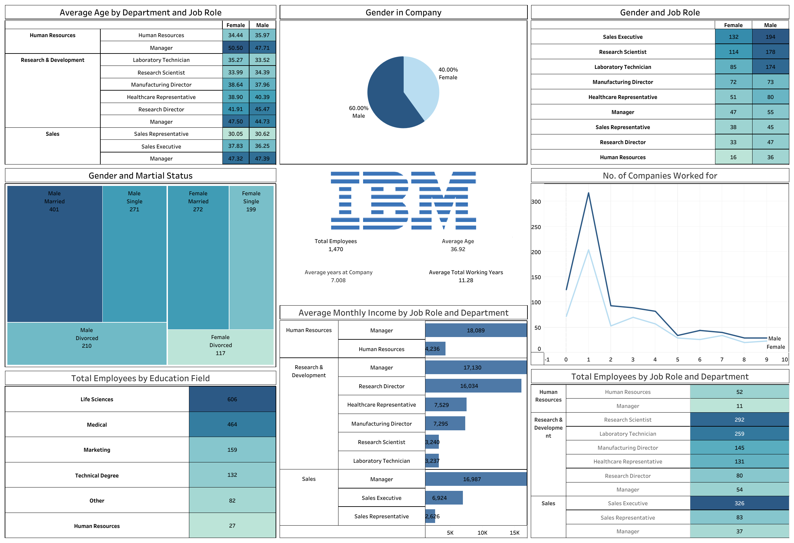

# IBM Employee Analytics Dashboard  

  

## 📊 Overview  
This **IBM Employee Analytics Dashboard** provides insights into **employee demographics, job roles, salaries, and work experience**. It helps HR and management analyze workforce distribution efficiently.  

## 🚀 Features  
- **Gender and Job Role Analysis**  
- **Average Monthly Income by Department**  
- **Total Employees by Education Field**  
- **Marital Status and Employee Count**  
- **Number of Companies Worked For**  

## 📷 Dashboard Preview  
  

## 🛠 Tech Stack  
- **Tableau / Power BI** – Dashboard creation  
- **Python / SQL** – Data preprocessing and analysis  
- **Excel / CSV** – Data storage  

## 📥 How to Use  
1. **Clone this repository**:  
   ```sh
   git clone https://github.com/yourusername/IBM-Employee-Dashboard.git
